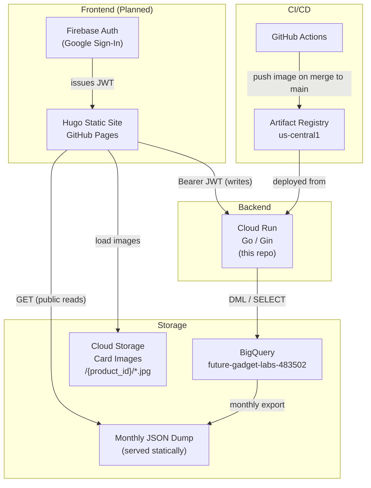
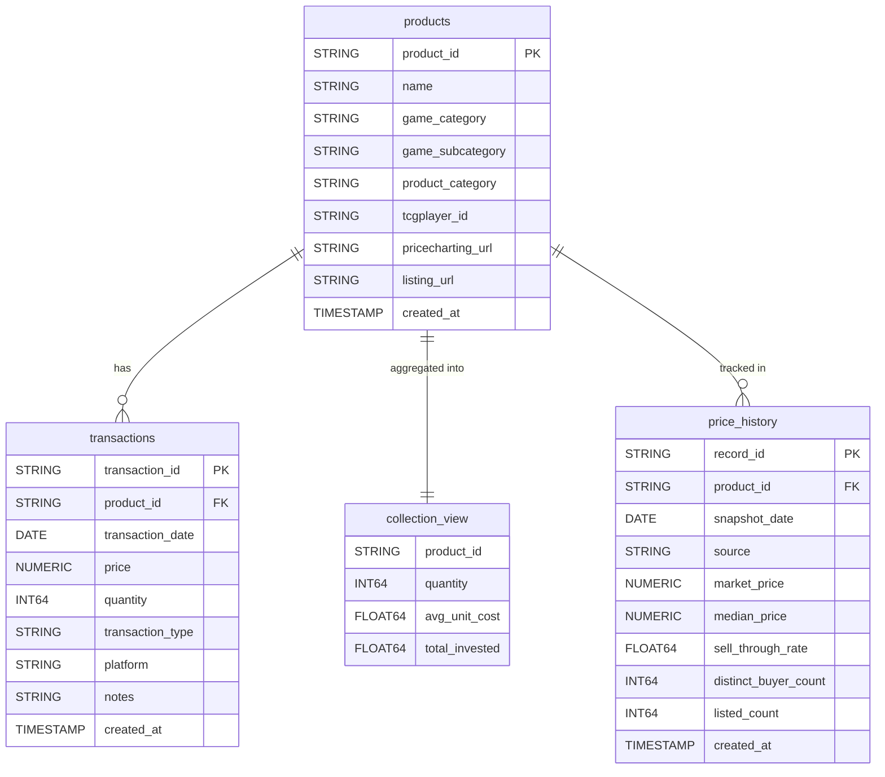
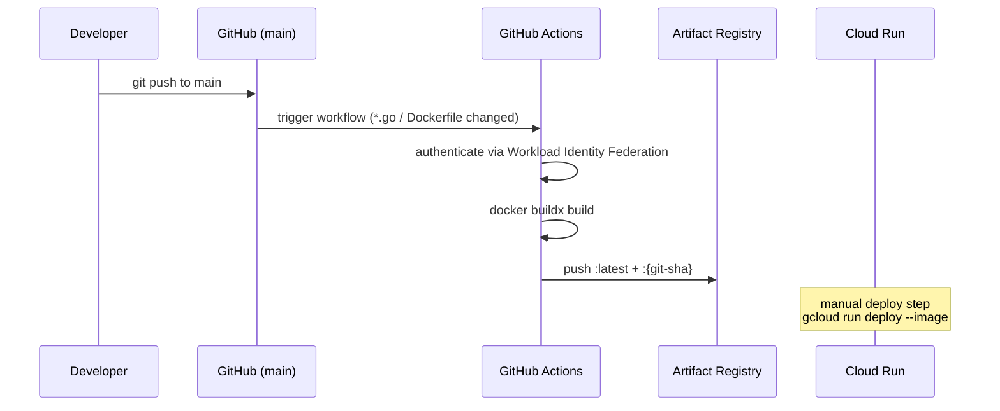
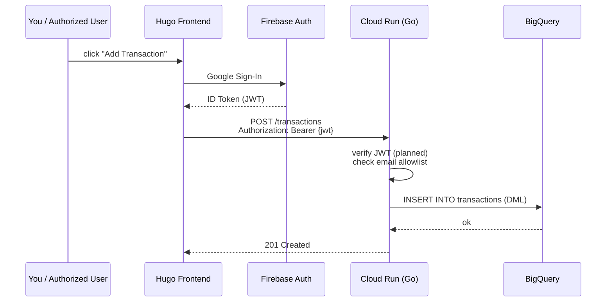

# collection-showcase-backend

Go/Cloud Run backend for tracking a TCG card collection — purchases, sales, inventory, and market price history. Part of the Future Gadget Labs collection showcase system.

---

## System Architecture



**Key design decisions:**
- The frontend reads from a **pre-exported monthly JSON** — not BigQuery directly. This keeps BQ query costs near zero.
- Writes (add product, log transaction, price snapshot) hit Cloud Run → BigQuery.
- Card images live in GCS at `/{product_id}/1.jpg`, `/{product_id}/2.jpg` etc. The frontend lists by prefix.
- Cloud Run **scales to zero** — no cost at rest, ~50-100ms Go cold start.

---

## Data Model



**`collection` is a BigQuery VIEW**, not a table. It is derived from `transactions`:
- `quantity` = sum of buys − sum of sells (only products where quantity > 0 are shown)
- `avg_unit_cost` = weighted average of buy prices
- `total_invested` = sum of (buy price × buy quantity)

### BigQuery Datasets

| Dataset | Tables | Purpose |
|---|---|---|
| `inventory` | `products`, `transactions`, `collection` (view) | What you own and what you've traded |
| `market_data` | `price_history` | Periodic price snapshots from external sources |

### Field reference

**`game_category`** examples: `pokemon`, `mtg`, `yugioh`, `lorcana`

**`product_category`** examples: `booster_box`, `etb`, `booster_pack`, `single`, `tin`, `bundle`

**`transaction_type`**: `buy` or `sell`

**`platform`** examples: `tcgplayer`, `ebay`, `facebook`, `local`

**`price_history.source`** examples: `tcgplayer`, `pricecharting`, `ebay`

---

## API Reference

Base URL (local): `http://localhost:8080`

All list endpoints accept `?limit=` (default 1000) and `?offset=` query params.

### Health

| Method | Path | Description |
|---|---|---|
| GET | `/health` | Returns `{"status":"ok"}` |

### Products

| Method | Path | Description |
|---|---|---|
| GET | `/products` | List all products |
| GET | `/products/:id` | Get one product |
| POST | `/products` | Create a product |
| PUT | `/products/:id` | Partial update |
| DELETE | `/products/:id` | Delete product + all transactions + all price history |

**POST /products body:**
```json
{
  "name": "Prismatic Evolutions ETB",
  "game_category": "pokemon",
  "game_subcategory": "Prismatic Evolutions",
  "product_category": "etb",
  "tcgplayer_id": "123456",
  "pricecharting_url": "https://www.pricecharting.com/...",
  "listing_url": "https://www.ebay.com/itm/..."
}
```

### Transactions

| Method | Path | Description |
|---|---|---|
| GET | `/transactions` | List all transactions |
| GET | `/transactions/:id` | Get one transaction |
| POST | `/transactions` | Log a buy or sell |
| PUT | `/transactions/:id` | Partial update |
| DELETE | `/transactions/:id` | Delete transaction |

**POST /transactions body:**
```json
{
  "product_id": "uuid-here",
  "transaction_date": "2026-03-17",
  "price": 49.99,
  "quantity": 1,
  "transaction_type": "buy",
  "platform": "tcgplayer",
  "notes": "sealed, bought at retail"
}
```

### Collection (read-only view)

| Method | Path | Description |
|---|---|---|
| GET | `/collection` | Current inventory (all products with qty > 0) |
| GET | `/collection/:product_id` | Inventory position for one product |

**Response:**
```json
{
  "product_id": "uuid-here",
  "quantity": 3,
  "avg_unit_cost": 49.99,
  "total_invested": 149.97
}
```

### Price History

| Method | Path | Description |
|---|---|---|
| GET | `/price-history` | List snapshots (filter: `?product_id=`, `?source=`) |
| POST | `/price-history` | Insert a price snapshot |
| DELETE | `/price-history/:record_id` | Delete a snapshot |

**POST /price-history body:**
```json
{
  "product_id": "uuid-here",
  "snapshot_date": "2026-03-17",
  "source": "tcgplayer",
  "market_price": 64.99,
  "median_price": 59.99,
  "sell_through_rate": 0.82,
  "distinct_buyer_count": 47,
  "listed_count": 31
}
```

---

## Deployment Flow



The GitHub Action **only pushes to Artifact Registry**. Promoting a new image to Cloud Run is a manual step (or you can add a deploy step to the workflow later). This gives you a gate before live traffic changes.

---

## Request Flow (Write Path)



> Auth middleware (Firebase JWT verification + email allowlist) is planned but not yet implemented.

---

## GCS Image Storage

Card images live in a public GCS bucket:

```
gs://future-gadget-labs-tcg-images/
├── {product_id}/
│   ├── 1.jpg
│   ├── 2.jpg
│   └── 3.jpg
└── {product_id}/
    └── 1.jpg
```

The frontend lists all images for a product using the GCS prefix API:
```
GET https://storage.googleapis.com/storage/v1/b/{bucket}/o?prefix={product_id}/
```

**Setup:**
```bash
gsutil mb -l us-central1 gs://future-gadget-labs-tcg-images
gsutil iam ch allUsers:objectViewer gs://future-gadget-labs-tcg-images
```

Then upload photos directly from your phone or desktop:
```bash
gsutil cp ./my-photo.jpg gs://future-gadget-labs-tcg-images/{product_id}/1.jpg
```

---

## Cost Estimate

At personal-collection scale, this is effectively **free**:

| Service | Free Tier | Realistic Usage |
|---|---|---|
| BigQuery storage | 10 GB/mo | < 1 MB (hundreds of rows) |
| BigQuery queries | 1 TB/mo | Negligible (monthly dump + occasional CRUD) |
| Cloud Run | 2M req/mo | < 1K req/mo |
| Artifact Registry | 0.5 GB free | ~50 MB per image |
| GCS | 5 GB/mo | ~1 GB for photos |

The monthly JSON export strategy means the frontend never queries BigQuery directly — all read traffic hits a static file.

---

## Setup

### 1. GCP Prerequisites

```bash
# Enable APIs
gcloud services enable \
  bigquery.googleapis.com \
  run.googleapis.com \
  artifactregistry.googleapis.com \
  iamcredentials.googleapis.com \
  --project=future-gadget-labs-483502

# Create Artifact Registry repo
gcloud artifacts repositories create tcg-collection \
  --repository-format=docker \
  --location=us-central1 \
  --project=future-gadget-labs-483502
```

### 2. Create BigQuery Resources

```bash
go run ./cmd/setup/main.go
```

This is idempotent — safe to run multiple times. Creates:
- Datasets: `inventory`, `market_data`
- Tables: `products`, `transactions`, `price_history`
- View: `collection`

### 3. GitHub Actions — Workload Identity Federation (WIF)

WIF lets GitHub Actions authenticate to GCP **without a stored service account key**:

```bash
PROJECT=future-gadget-labs-483502
GITHUB_REPO=FutureGadgetLabs/collection-showcase-backend

# Create WIF pool
gcloud iam workload-identity-pools create github-pool \
  --location=global \
  --project=$PROJECT

# Create provider
gcloud iam workload-identity-pools providers create-oidc github-provider \
  --location=global \
  --workload-identity-pool=github-pool \
  --issuer-uri=https://token.actions.githubusercontent.com \
  --attribute-mapping="google.subject=assertion.sub,attribute.repository=assertion.repository" \
  --attribute-condition="assertion.repository=='$GITHUB_REPO'" \
  --project=$PROJECT

# Create service account
gcloud iam service-accounts create github-actions-sa \
  --display-name="GitHub Actions" \
  --project=$PROJECT

# Grant it permissions it needs
gcloud projects add-iam-policy-binding $PROJECT \
  --member="serviceAccount:github-actions-sa@$PROJECT.iam.gserviceaccount.com" \
  --role="roles/artifactregistry.writer"

# Bind WIF pool to service account
POOL_ID=$(gcloud iam workload-identity-pools describe github-pool \
  --location=global --project=$PROJECT --format="value(name)")

gcloud iam service-accounts add-iam-policy-binding \
  github-actions-sa@$PROJECT.iam.gserviceaccount.com \
  --role=roles/iam.workloadIdentityUser \
  --member="principalSet://iam.googleapis.com/${POOL_ID}/attribute.repository/${GITHUB_REPO}"
```

Then get the values for your GitHub secrets:
```bash
# WIF_PROVIDER value:
gcloud iam workload-identity-pools providers describe github-provider \
  --location=global \
  --workload-identity-pool=github-pool \
  --project=$PROJECT \
  --format="value(name)"

# WIF_SERVICE_ACCOUNT value:
echo "github-actions-sa@$PROJECT.iam.gserviceaccount.com"
```

Add both as **GitHub repository secrets**:
- `WIF_PROVIDER` → the full provider resource name
- `WIF_SERVICE_ACCOUNT` → the service account email

### 4. Deploy to Cloud Run

After the GitHub Action pushes an image:

```bash
gcloud run deploy collection-showcase \
  --image=us-central1-docker.pkg.dev/future-gadget-labs-483502/tcg-collection/collection-showcase:latest \
  --region=us-central1 \
  --allow-unauthenticated \
  --memory=256Mi \
  --cpu=1 \
  --min-instances=0 \
  --max-instances=3 \
  --project=future-gadget-labs-483502
```

> `--allow-unauthenticated` is fine for now since reads are public and write auth will be enforced at the application level (Firebase JWT middleware — planned).

### 5. Run Locally

```bash
cp .env.example .env
# fill in values, then:
source .env
go run .
```

---

## Planned

- [ ] Firebase JWT middleware (verify token on all write routes)
- [ ] Email allowlist (env var `ALLOWED_EMAILS`) for authorized writers
- [ ] Monthly BQ → JSON export (Cloud Scheduler + Cloud Run job)
- [ ] Hugo frontend with Firebase Sign-In
- [ ] Price history ingestion job (TCGPlayer / PriceCharting scraper)
